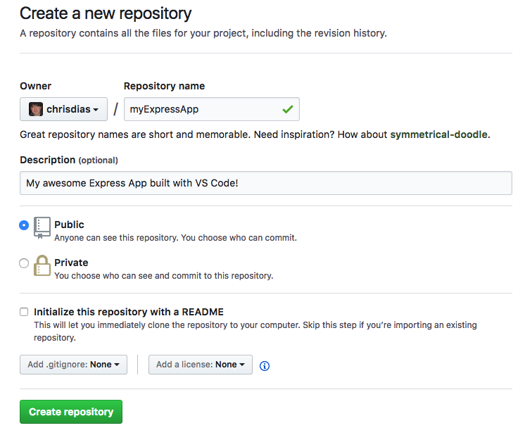
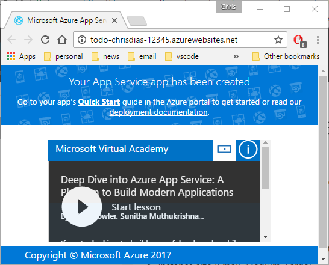
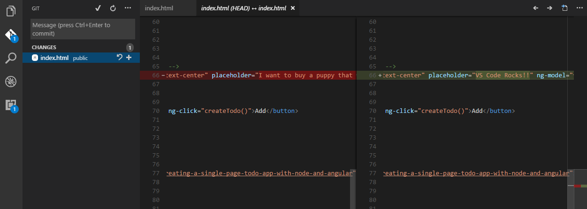
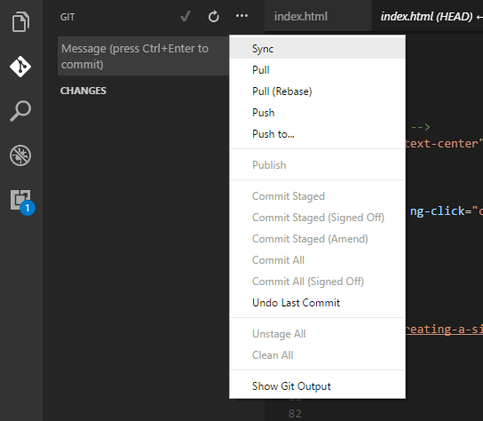

# Deploying your Node.js Application

In this walkthrough, you will learn how to deploy a high availability Node.js web app using Azure AppService to host the site and Azure DocumentDB to host the NoSQL MongoDB database. The sample app you will deploy uses Node.js, Express, and a MongoDB database. Using Azure AppService, you can simply upload your code directly to the site and Azure will Azure will automatically handle the deployment. However, in this walkthrough we will take it one step further and set up a continuous deployment pipeline through a public Github repository. You can later configure Azure AppService to auto-scale your application, load balance, and more. 

Azure DocumentDB is a fast and flexible NoSQL database service for all applications that need consistent, globally distributed, single-digit millisecond latency at any scale. It is a fully managed cloud database, it supports both document and key-value store models, and best of all it can be configured to have a fully compatible MongoDB API, meaning you don't need to change your code to take advantage of the service's capabilities.

## What You'll Need

**An Azure Account:** You will need an Azure account to provision resources to host your website and database. If you don't have an Azure subscription, [sign up today](https://azure.microsoft.com/en-us/free/) for a **free** 30 day account with **$200** in Azure Credits to try out any combination of Azure services.

**A GitHub Account:** We will set up a continuous deployment "pipeline" from a Github repository to the Azure Website, which is a better practice than deploying directly to the site. With this setup, you can use version control to roll back changes, configure different branches to deploy to different development "slots" (e.g. development or production) and more. We'll assume a public repository for simplicity, but you can use a private repository too. You'll simply need to provide an access token so the service can pull the source code whenever you push changes.

**Code:** In this walkthrough we'll use a simple ["ToDo" application](https://github.com/chrisdias/node-todo.git) to demonstrate the basic workflow. If you have code for your application, you can also deploy it using this guide.

If this sounds complicated, don't worry, it isn't :).

-------------------------------------


The first thing we'll need to do is get our source code into a GitHub repository. Browse to your GitHub account and [create a new public repository](https://github.com/new).



---

We are going to follow the instructions provided by GitHub to create a new repository on the command line, but with a few changes. 
It is a good practice to include a `.gitignore` file in your repository that excludes the `node_modules` folder. We'll do this instead of creating a `README.md` file and we'll add and commit all of the files in the workspace (except `node_modules` of course): 

``` bash
echo "node_modules" >> .gitignore
git init
git add .
git commit -m "first commit"
git remote add origin https://github.com/**YourGitHubAccount**/myExpressApp.git
git push -u origin master
```

Next, we will create an Azure Website to host our app. Once we have that, we'll configure the site to pull and deploy from the Git repository every time we push changes. To create the site, we'll use the new, cross platform Azure CLI.

> [Install the Azure CLI](https://docs.microsoft.com/en-us/cli/azure/install-azure-cli)

The following CLI commands will create our site and set up continuous deployment. Make sure you name your site properly per the comments.

``` bash
# Follow the login instructions
az login

# Create an Azure Resource Group which is essentially a container for all of your application resources.
az group create -l westus -n myExpressAppGroup

# Create an Azure App Service Plan which is essentially the machine on which your application will be hosted.
# In this walkthrough, we will use a FREE plan which will host your app on a machine with other websites.
az appservice plan create -n myExpressAppPlan -g myExpressAppGroup -l westus --sku FREE

# Now create the website and give it a unique name as it will be referenced as http://**myUniqueName-ExpressApp**.azurewebsites.net
az appservice web create -n myUniqueName-ExpressApp -g myExpressAppGroup -p myExpressAppPlan

# Let's test that our site is up and running. It will be a temporary site as we have not deployed any code here yet.
az appservice web browse -n myUniqueName-ExpressApp -g myExpressAppGroup

# Configure the site for continuous deployment through our GitHub repository.
az appservice web source-control config --repo-url https://github.com/yourgithubaccount/myExpressApp -n myUniqueName-ExpressApp -g myExpressAppGroup
```

Refresh the site and you should see your Express application hosted in the cloud on Azure! 



---

To test continuous deployment, make a change to the `index.jade` file found in the `views` folder and make a local commit.



Use the overflow menu to **Sync** the change with the GitHub repository. 



Finally, the site will recognize a change has been pushed and the content will automatically be redeployed. 


